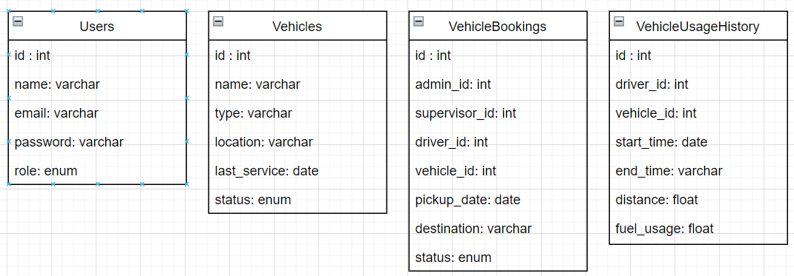

## Installation

1. Clone this repository to your local machine:
   git clone https://github.com/puskipus/skill-test-sekawan-media.git

# Laravel Backend Application

1. Navigate to the project directory:
    cd backend
2. Install dependencies using Composer:
    composer install
3. Copy the `.env.example` file and rename it to `.env`:
4. Configure your `.env` file with your database connection details and any other necessary configurations.
5. Run database migrations to create the necessary tables:
    php artisan migrate
6. Run database seeders to populate the database with sample data (Optional: You can configure or add additional seeder ):
    php artisan db:seed
7. Generate JWT secret key for authentication
    php artisan jwt:secret
8. To start the Laravel development server, run the following command:
    php artisan serve

# ReactJS Client Application

1. Navigate to the project directory:
    cd frontend
2. Install dependencies using npm:
    npm install
3. Configure your `.env` file with your backend url.
4. Start the development server:
    npm start

## Default Username & Password Account

- Admin : - email => admin1@gmail.com | password => admin123
- Supervisor : - email => supervisor1@gmail.com | password => supervisor123
- Driver : - email => driver1@gmail.com | password => driver123

## Tools

- Database mysql v10.4.22-MariaDB
- PHP v8.1.2
- Laravel v10.10
- NodeJS v18.15.0
- ReactJS v18.2.0

##Documentation

#Physical Data Model

#Activity Diagram

